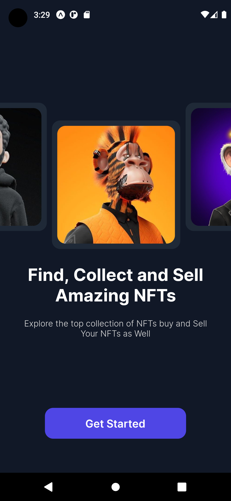
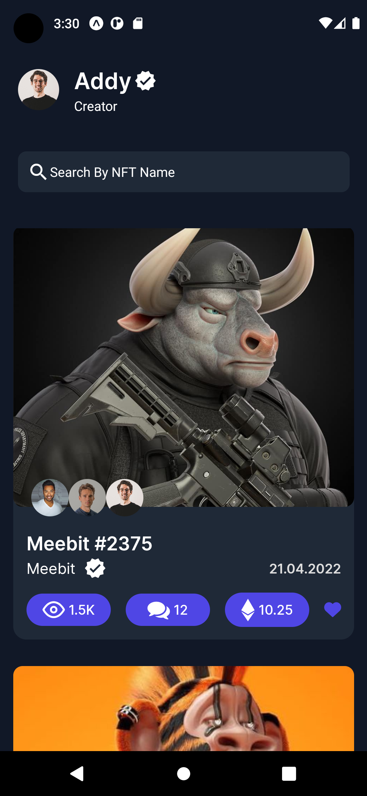

# npm i expo-font

- handle fonts
- handle image and avatar folder

# type data

in constants folder

- react navigation to handle navigation

# create components in screens folder

- Welcome
- Home
- NFTDetails

# to create theme for mobile app

- create file in constants folder to add pixelRatio
  -fontScale
  -colors

* contribute them and export in index file
* create welcome screen
* create button component

* handle navigation to move to home page
* handle animation
* handle saveArea view

# home page

- nft card
- nft image
- nft avatar
- nft title
- nft date
- nft info
- homeheader

* icon from expo
* handle navigation to nft-details screen
* last create ui and functionalty for nft-details screen
